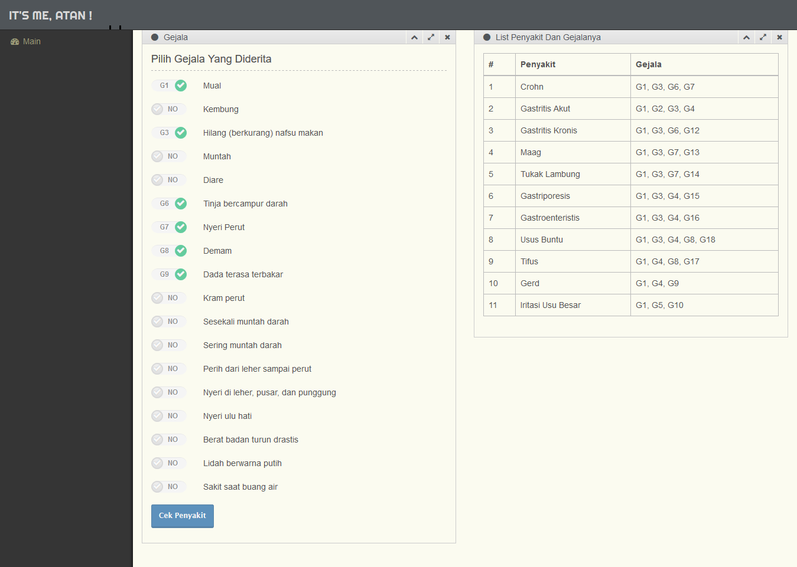
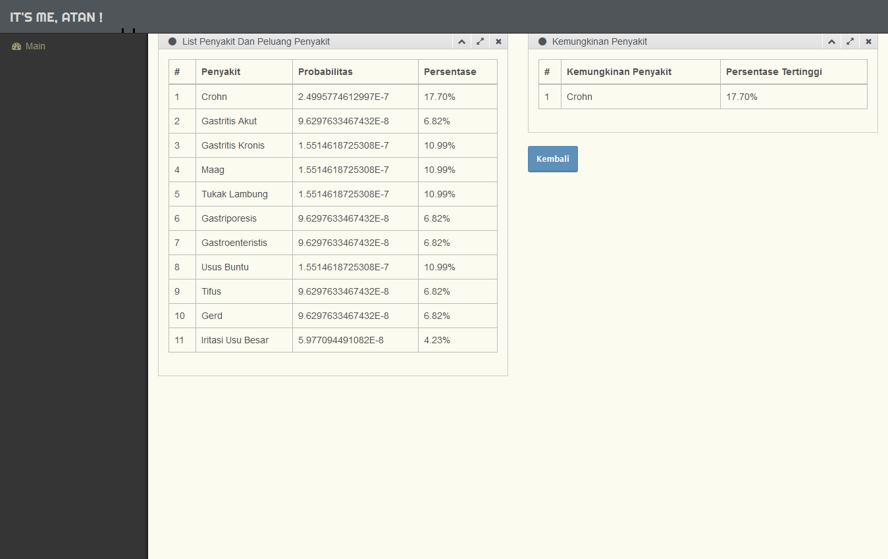

# Expert System

Expert system for detecting digestive disease.
This repository is archived from 6th semester on expert system course, Sriwijaya University.

## Team members:

* Yunita (Lecturer) - [Scholar](https://scholar.google.com/citations?user=qwrSdQMAAAAJ&hl=en)
* Atan Wicaksana Ramadhanti - [LinkedIn](https://www.linkedin.com/in/atan-w-ramadhanti-845936188/), [Instagram](https://www.instagram.com/atanwrawr/)
* Muhammad Irfan Triananto Putra - [LinkedIn](https://www.linkedin.com/in/trianantoputra/)

## Getting Started

These instructions will get you a copy of the project up and running on your local machine for development and testing purposes.

### Prerequisites

What things you need to install the software

* Local server - [XAMPP](https://www.apachefriends.org/index.html), etc.
* Browser - [Google Chrome](https://www.google.com/chrome/), [Firefox](https://www.mozilla.org/en-US/firefox/new/), etc.

### Running the tests

* open XAMPP, run Apache.
* open url in the browser "localhost/{folder name}" (or 127.0.0.1), use one of the following:
```
localhost/expert-system-atan
localhost:8080/expert-system-atan // if manually used port 8080
127.0.0.1/expert-system-atan
```

### Input

choose one or more of the following symptoms:

<p align="center">
  
</p>

### Output

the systems will give the percentage of likely the patient has the disease.

<p align="center">
  
</p>